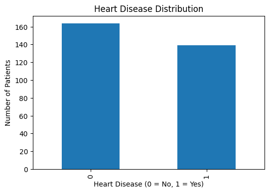
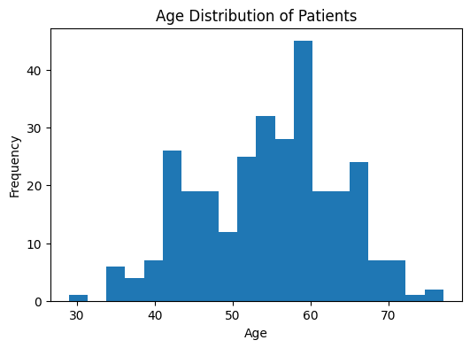
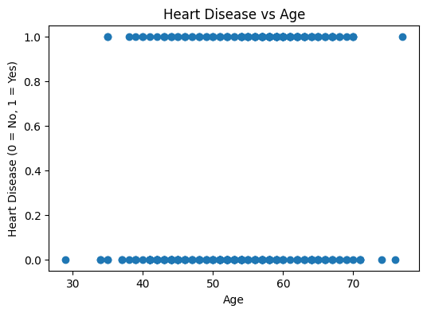
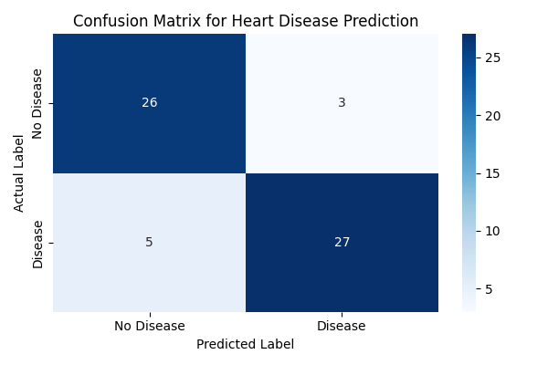
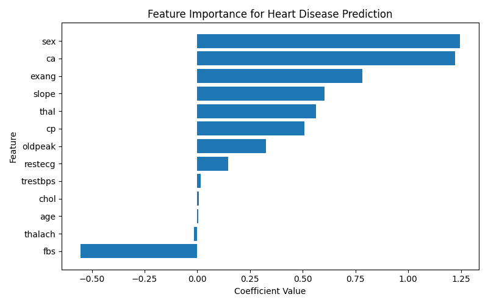
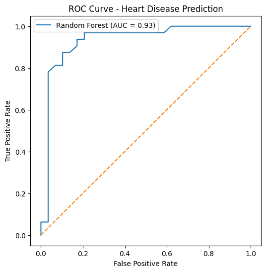

# Heart Disease Prediction with Machine Learning

This project applies machine learning techniques to predict heart disease using the Cleveland Heart Disease dataset.

The goal of this project is to demonstrate a full machine learning workflow including:

- exploratory data analysis
- data preparation
- model training
- model evaluation
- model interpretation

---

# Dataset

The dataset used is the **Cleveland Heart Disease dataset**, which contains medical attributes used to help predict the presence of heart disease.

Key features include:

- age
- sex
- chest pain type (cp)
- resting blood pressure (trestbps)
- cholesterol (chol)
- maximum heart rate (thalach)
- exercise induced angina (exang)
- ST depression (oldpeak)

Target variable:

```
0 = No heart disease
1 = Heart disease present
```

---

# Exploratory Data Analysis

### Heart Disease Distribution



### Age Distribution



### Heart Disease vs Age



---

# Model Development

Two machine learning models were trained and evaluated:

- Logistic Regression
- Random Forest Classifier

The dataset was split into training and testing sets using an 80/20 split.

---

# Model Evaluation

### Confusion Matrix



### Feature Importance (Random Forest)



### ROC Curve



The Random Forest model achieved an **AUC of approximately 0.93**, indicating strong classification performance.

---

# Technologies Used

- Python
- Pandas
- NumPy
- Scikit-learn
- Matplotlib
- Seaborn
- Jupyter Notebook

---

# Project Structure

```
heart-disease-ml-prediction
│
├── data
│
├── notebooks
│   └── heart_disease_prediction.ipynb
│
├── images
│   ├── heart_disease_distribution.png
│   ├── age_distribution.png
│   ├── heart_disease_vs_age.png
│   ├── confusion_matrix.png
│   ├── feature_importance.png
│   └── roc_curve.png
│
└── requirements.txt
```

---

# Purpose

This project demonstrates how machine learning can be applied to healthcare data to assist in identifying potential heart disease risk.

It also serves as a portfolio project demonstrating practical skills in:

- data analysis
- machine learning modeling
- model evaluation
- visualization
