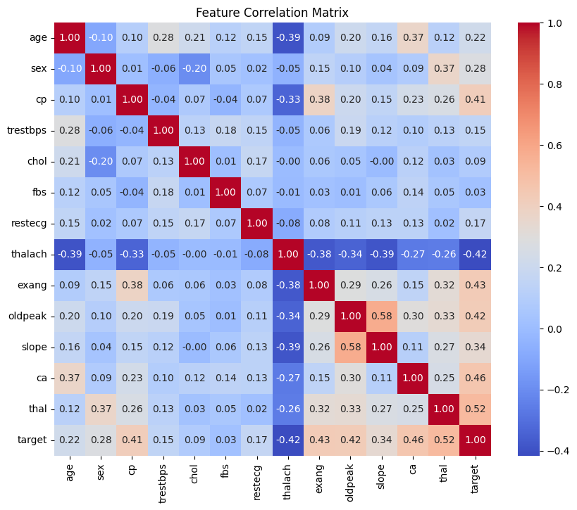
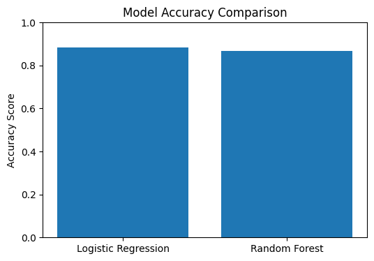

# Heart Disease Prediction with Machine Learning

This project applies machine learning techniques to predict heart disease using the Cleveland Heart Disease dataset.

## Overview

The notebook demonstrates a full machine learning workflow:

- exploratory data analysis
- data preparation
- Logistic Regression
- Random Forest
- model evaluation
- feature importance
- ROC analysis

## Dataset

The dataset contains patient-level clinical variables used to predict the presence of heart disease.

Target variable:

- `0` = No heart disease
- `1` = Heart disease present

## Models Used

- Logistic Regression
- Random Forest Classifier

## Results

- Logistic Regression Accuracy: **0.885**
- Random Forest Accuracy: **0.869**
- Random Forest ROC AUC: **0.93**

## Exploratory Data Analysis

### Heart Disease Distribution


### Age Distribution


### Heart Disease vs Age


### Correlation Matrix


## Model Evaluation

### Confusion Matrix


### Random Forest Feature Importance


### ROC Curve


### Model Accuracy Comparison


## Technologies Used

- Python
- Pandas
- NumPy
- Matplotlib
- Seaborn
- Scikit-learn
- Jupyter Notebook

## Project Structure

```text
heart-disease-ml-prediction/
├── data/
├── images/
├── notebook/
├── requirements.txt
└── README.md
```
